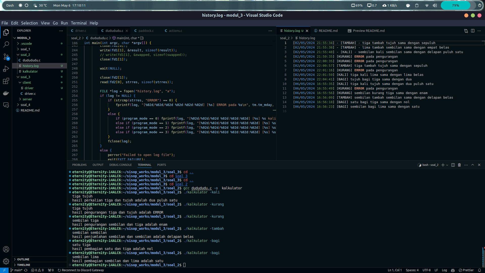

# Repository Praktikum Sistem Operasi Modul 3 - IT04
## Anggota

| Nama                      | NRP        |
|---------------------------|------------|
|Nathan Kho Pancras         | 5027231002 |
|Athalla Barka Fadhil       | 5027231018 |
|Muhammad Ida Bagus Rafi H  | 5027221059 |


## Daftar Isi

- [Soal 1](#soal-1)
- [Soal 2](#soal-2)
- [Soal 3](#soal-3)
- [Soal 4](#soal-4)

# Soal 1

## Deskripsi Soal

### Catatan

## Pengerjaan


# Soal 2

## Deskripsi Soal

Max Verstappen 🏎️ seorang pembalap F1 dan programer memiliki seorang adik bernama Min Verstappen (masih SD) sedang menghadapi tahap paling kelam dalam kehidupan yaitu perkalian matematika, Min meminta bantuan Max untuk membuat kalkulator perkalian sederhana (satu sampai sembilan). Sembari Max nguli dia menyuruh Min untuk belajar perkalian dari web (referensi) agar tidak bergantung pada kalkulator.
(Wajib menerapkan konsep pipes dan fork seperti yang dijelaskan di modul Sisop. Gunakan 2 pipes dengan diagram seperti di modul 3).

### Catatan

Global variable yang digunakan untuk mempermudah pengerjaan:

```c
// Modes
volatile sig_atomic_t program_mode = 0;

// Inputted values
char input1[10];
char input2[10];
int num1, num2, result;

// Output
char strres[1024];

// Time variables
time_t T;
struct tm tm;
```

## Pengerjaan

> a. Sesuai request dari adiknya Max ingin nama programnya dudududu.c. Sebelum program parent process dan child process, ada input dari user berupa 2 string. Contoh input: tiga tujuh. 

Karena input dipisah oleh spasi dan berakhir dengan enter, maka saya membuat scanf simple:

```c
scanf("%s%s", input1, input2);
    while((getchar()) != '\n');
```

> b. Pada parent process, program akan mengubah input menjadi angka dan melakukan perkalian dari angka yang telah diubah. Contoh: tiga tujuh menjadi 21. 

Saya mengambil contoh kode penerapan pipe dari modul, kemudian saya pindah `scanf` tadi sebelum melakukan fork. Kemudian karena ini merupakan kalkulator, tetapi input kita bilangan di bahasa indonesia maka saya membuat fungsi untuk melakukan konversi dari str ke int seperti ini:

```c
int strint(char* str) {
    if (strcmp(str, "satu") == 0) return 1;
    else if (strcmp(str, "dua") == 0) return 2;
    else if (strcmp(str, "tiga") == 0) return 3;
    else if (strcmp(str, "empat") == 0) return 4;
    else if (strcmp(str, "lima") == 0) return 5;
    else if (strcmp(str, "enam") == 0) return 6;
    else if (strcmp(str, "tujuh") == 0) return 7;
    else if (strcmp(str, "delapan") == 0) return 8;
    else if (strcmp(str, "sembilan") == 0) return 9;
    else exit(EXIT_FAILURE);
}
```

Setelah itu saya membuat fungsi untuk operasi yang dilakukan, untuk sekarang perkalian.

```c
int opr_func() {
    return result = num1 * num2;
}
```

result, num1, dan num2 merupakan global variable, sehingga saya bisa melakukan:

```c
num1 = strint(input1);
num2 = strint(input2);
result = opr_func();
```

> c. Pada child process, program akan mengubah hasil angka yang telah diperoleh dari parent process menjadi kalimat. Contoh: `21` menjadi “dua puluh satu”.

Pertama saya masukkan result ke child process: `write(fd1[1], &result, sizeof(result));`.

Kemudian di child process saya read, `read(fd1[0], &result, sizeof(result));` dan karena result masih berbentuk int, saya membuat fungsi lagi untuk mengubah int ke str:

```c
char* intstr(int num) {
    if (num == 0) return "nol" ;
    else if (num == 1) return "satu";
    else if (num == 2) return "dua";
    else if (num == 3) return "tiga";
    else if (num == 4) return "empat";
    else if (num == 5) return "lima";
    else if (num == 6) return "enam";
    else if (num == 7) return "tujuh";
    else if (num == 8) return "delapan";
    else if (num == 9) return "sembilan";
    ...
    else if (num == 81) return "delapan puluh satu";
    else return "ERROR";
}
```

Karena operasi yang dilakukan memiliki batas 9*9, maka saya buat fungsi ini untuk mengubah hanya sampai 81. Kemudian saya masukkan result ke fungsi ini, dan menggunakan strcpy untuk menyimpan result berbentuk str: `strcpy(strres, intstr(result));`

> d. Max ingin membuat program kalkulator dapat melakukan penjumlahan, pengurangan, dan pembagian, maka pada program buatlah argumen untuk menjalankan program : 
> - perkalian	: ./kalkulator -kali
> - penjumlahan	: ./kalkulator -tambah
> - pengurangan	: ./kalkulator -kurang
> - pembagian	: ./kalkulator -bagi

Beberapa hari kemudian karena Max terpaksa keluar dari Australian Grand Prix 2024 membuat Max tidak bersemangat untuk melanjutkan programnya sehingga kalkulator yang dibuatnya cuma menampilkan hasil positif jika bernilai negatif maka program akan print “ERROR” serta cuma menampilkan bilangan bulat jika ada bilangan desimal maka dibulatkan ke bawah.

Untuk contoh argumen memakai 4 argumen di argv[1], sehingga kita bisa handle args dengan cara seperti berikut:

```c
if (argc == 1) {
        return 0;
    }
else if (argc > 1) {
    if (strcmp(argv[1], "-kali") == 0) {
        program_mode = 0;
    } 
    else if (strcmp(argv[1], "-tambah") == 0) {
        program_mode = 1;
    }
    else if (strcmp(argv[1], "-kurang") == 0) {
        program_mode = 2;
    }
    else if (strcmp(argv[1], "-bagi") == 0) {
        program_mode = 3;
    }
}
```

Kemudian saya menambahkan operasi operasi yang lain kedalam `opr_func` dengan switch case berdasarkan program_mode:

```c
int opr_func() {
    switch (program_mode) {
        case 0:
            return result = num1 * num2;
        case 1:
            return result = num1 + num2;
        case 2:
            return result = num1 - num2;
        case 3:
            return result = num1 / num2;
    }
}
```

Sekarang program sudah bisa mengeksekusi operasi perkalian, penambahan, pengurangan, dan pembagian. 

> e. Setelah diberi semangat, Max pun melanjutkan programnya dia ingin (pada child process) kalimat akan di print dengan contoh format : 
> - perkalian	: “hasil perkalian tiga dan tujuh adalah dua puluh satu.”
> - penjumlahan	: “hasil penjumlahan tiga dan tujuh adalah sepuluh.”
> - pengurangan	: “hasil pengurangan tujuh dan tiga adalah empat.”
> - pembagian	: “hasil pembagian tujuh dan tiga adalah dua.”

Saya pun membuat switch case lagi menggunakan program_mode untuk menentukan output:

```c
char* output_type () {
    switch (program_mode) {
        case 0:
            return "perkalian";
        case 1:
            return "penjumlahan";
        case 2:
            return "pengurangan";
        case 3:
            return "pembagian";
        default:
            exit(EXIT_FAILURE);
    }
}
```

Kemudian kita lakukan printf terhadap hasil sesuai format soal:
`printf("hasil %s %s dan %s adalah %s\n", output_type(), input1, input2, strres);`

> f. Max ingin hasil dari setiap perhitungan dicatat dalam sebuah log yang diberi nama histori.log. Pada parent process, lakukan pembuatan file log berdasarkan data yang dikirim dari child process. 
> 
> - Format: [date] [type] [message]
> - Type: KALI, TAMBAH, KURANG, BAGI
> - Ex:

```
[10/03/24 00:29:47] [KALI] tujuh kali enam sama dengan empat puluh dua.
[10/03/24 00:30:00] [TAMBAH] sembilan tambah sepuluh sama dengan sembilan belas.
[10/03/24 00:30:12] [KURANG] ERROR pada pengurangan.
```

Pertama saya menambahkan `write(fd2[1], strres, strlen(strres)+1);` di child process sebelum close, kemudian menambahkan `read(fd2[0], strres, sizeof(strres));` di parent process untuk melakukan logging.

Saya inisialisasikan dulu global variable T dan tm:

```c
T = time(NULL);
tm = *localtime(&T);
```

Sekarang saya melakukan fopen biasa:

```c
FILE *log = fopen("history.log", "a");
        if (log != NULL) {
            if (strcmp(strres, "ERROR") == 0) {
                fprintf(log, "[%02d/%02d/%02d %02d:%02d:%02d] [%s] ERROR pada %s\n", tm.tm_mday, tm.tm_mon + 1, tm.tm_year + 1900, tm.tm_hour, tm.tm_min, tm.tm_sec, log_out(), output_type());
            }
            else {
                if (program_mode == 0) fprintf(log, "[%02d/%02d/%02d %02d:%02d:%02d] [%s] %s kali %s sama dengan %s\n", tm.tm_mday, tm.tm_mon + 1, tm.tm_year + 1900, tm.tm_hour, tm.tm_min, tm.tm_sec, log_out(), input1, input2, strres);
                else if (program_mode == 1) fprintf(log, "[%02d/%02d/%02d %02d:%02d:%02d] [%s] %s tambah %s sama dengan %s\n", tm.tm_mday, tm.tm_mon + 1, tm.tm_year + 1900, tm.tm_hour, tm.tm_min, tm.tm_sec, log_out(), input1, input2, strres);
                else if (program_mode == 2) fprintf(log, "[%02d/%02d/%02d %02d:%02d:%02d] [%s] %s kurang %s sama dengan %s\n", tm.tm_mday, tm.tm_mon + 1, tm.tm_year + 1900, tm.tm_hour, tm.tm_min, tm.tm_sec, log_out(), input1, input2, strres);
                else if (program_mode == 3) fprintf(log, "[%02d/%02d/%02d %02d:%02d:%02d] [%s] %s bagi %s sama dengan %s\n", tm.tm_mday, tm.tm_mon + 1, tm.tm_year + 1900, tm.tm_hour, tm.tm_min, tm.tm_sec, log_out(), input1, input2, strres);
            }
            fclose(log);
        }
        else {
            perror("Failed to open log file");
            exit(EXIT_FAILURE);
        }
```

Dimana output juga dipengaruhi oleh program_mode. 

## Output



# Soal 3

## Deskripsi Soal

Shall Leglerg🥶 dan Carloss Signs 😎 adalah seorang pembalap F1 untuk tim Ferrari 🥵. Mobil F1 memiliki banyak pengaturan, seperti penghematan ERS, Fuel, Tire Wear dan lainnya. Pada minggu ini ada race di sirkuit Silverstone. Malangnya, seluruh tim Ferrari diracun oleh Super Max Max pada hari sabtu sehingga seluruh kru tim Ferrari tidak bisa membantu Shall Leglerg🥶 dan Carloss Signs 😎 dalam race. Namun, kru Ferrari telah menyiapkan program yang bisa membantu mereka dalam menyelesaikan race secara optimal. Program yang dibuat bisa mengatur pengaturan - pengaturan dalam mobil F1 yang digunakan dalam balapan.

### Catatan

Directory:
```
├── client
│   └── driver.c
└── server
    ├── actions.c
    ├── paddock.c
    └── race.log
```

Port yang digunakan: 8080
IP: 127.0.0.1

Defined variables:
`#define MAX_LEN 1024`

## Pengerjaan

> a. Pada program actions.c, program akan berisi function function yang bisa di call oleh paddock.c

> b. Action berisikan sebagai berikut:
> - Gap [Jarak dengan driver di depan (float)]: Jika Jarak antara Driver dengan Musuh di depan adalah < 3.5s maka return Gogogo, jika jarak > 3.5s dan 10s return Push, dan jika jarak > 10s maka return Stay out of trouble.
> - Fuel [Sisa Bensin% (string/int/float)]: Jika bensin lebih dari 80% maka return Push Push Push, jika bensin di antara 50% dan 80% maka return You can go, dan jika bensin kurang dari 50% return Conserve Fuel.
> - Tire [Sisa Ban (int)]: Jika pemakaian ban lebih dari 80 maka return Go Push Go Push, jika pemakaian ban diantara 50 dan 80 return Good Tire Wear, jika pemakaian di antara 30 dan 50 return Conserve Your Tire, dan jika pemakaian ban kurang dari 30 maka return Box Box Box.
> - Tire Change [Tipe ban saat ini (string)]: Jika tipe ban adalah Soft return Mediums Ready, dan jika tipe ban Medium return Box for Softs.

		Contoh:
		[Driver] : [Fuel] [55%]
		[Paddock]: [You can go]

Sesuai soal, saya membuat functions untuk tiap kasus:

```c
char* gap_func(float gap) {
    if (gap <= 3.5) return "Gogogo";
    else if (gap <= 10) return "Push";
    else return "Stay out of trouble";
}

char* fuel_func(float fuel) {
    if (fuel > 80) return "Push Push Push";
    else if (fuel >= 50) return "You can go";
    else return "Conserve Fuel";
}

char* tire_func(int tire) {
    if (tire > 80) return "Go Push Go Push";
    else if (tire >= 50) return "Good Tire Wear";
    else if (tire > 30) return "Conserve Your Tire";
    else return "Box Box Box";
}

char* tire_change(char* type) {
    if (strcmp(type, "Soft") == 0) return "Mediums Ready";
    else if (strcmp(type, "Medium") == 0) return "Box for Softs";
}
```

> c. Pada paddock.c program berjalan secara daemon di background, bisa terhubung dengan driver.c melalui socket RPC.

Karena paddock berjalan sebagai daemon dan bertindak sebagai server, maka saya pertama mengambil kode RPC server dari modul kemudian kode untuk membuat program menjadi daemon setelah dilakukan listen di port yang ditentukan (8080), dan untuk accept sampai output dilakukan didalam while(1).

> d. Program paddock.c dapat call function yang berada di dalam actions.c.

```c
// ... (kode modul untuk RPC)

if (listen(serv_socket, 3) < 0) {
    perror("Listen failed");
    exit(EXIT_FAILURE);
}

// ... (kode modul untuk daemon)

while (1) {
    // accept
    // read buffer

    // pemangillan actions.c sesuai argv yang akan dilakukan nanti
}
```

> e. Program paddock.c tidak keluar/terminate saat terjadi error dan akan log semua percakapan antara paddock.c dan driver.c di dalam file race.log
> 
> Format log:
```log
[Source] [DD/MM/YY hh:mm:ss]: [Command] [Additional-info]
ex :
[Driver] [07/04/2024 08:34:50]: [Fuel] [55%]
[Paddock] [07/04/2024 08:34:51]: [Fuel] [You can go]
```

> f. Program driver.c bisa terhubung dengan paddock.c dan bisa mengirimkan pesan dan menerima pesan serta menampilan pesan tersebut dari paddock.c sesuai dengan perintah atau function call yang diberikan.

> h. Untuk mengaktifkan RPC call dari driver.c, bisa digunakan in-program CLI atau Argv (bebas) yang penting bisa send command seperti poin B dan menampilkan balasan dari paddock.c
>	
> Contoh:
```bash
Argv: 
./driver -c Fuel -i 55% 
in-program CLI:
Command: Fuel
Info: 55%
```


Saya memutuskan untuk memakai argv untuk soal ini.

Paddock:
```c
char cmd[MAX_LEN], stat[MAX_LEN], *resp;
    int mark;

while (1) {
    // accept incoming connection...

    // clear buffer + read
    memset(buffer, 0, MAX_LEN);
    int cli_buf = read(cli_socket, buffer, MAX_LEN);
    if (cli_buf < 0) {
        perror("Read failed");
        break;
    } 
    else if (cli_buf == 0) {
        break;
    }

    resp = NULL;
    mark = 1;

    // Handling args
    sscanf(buffer, "%s %s", cmd, stat);
    if (strcmp(cmd, "Gap") == 0) {
        float cur_gap = atof(stat); 
        resp = gap_func(cur_gap);
    }
    else if (strcmp(cmd, "Fuel") == 0) {
        float cur_fuel = atof(stat);
        resp = fuel_func(cur_fuel);
    }
    else if (strcmp(cmd, "Tire") == 0) {
        int cur_tire = atoi(stat);
        resp = tire_func(cur_tire);
    }
    else if (strcmp(cmd, "Tire_Change") == 0) {
        resp = tire_change(stat);
    }
    else {
        mark = 0;
    }

    log_func("Driver", cmd, stat);
    if (mark) {
        log_func("Paddock", cmd, resp);
    }

    if (resp != NULL && send(cli_socket, resp, strlen(resp), 0) < 0){
        perror("Send buffer failed");
    };

    close(cli_socket);
    sleep(5);
}
```

Penggunaan strcmp dilakukan untuk membandingkan arg yang diterima dari client yaitu driver kemudian melakukan fungsi yang sesuai. Log untuk paddock dijalankan hanya ketika paddock masuk ke salah satu if else, jika tidak maka hanya log driver yang dicatat. Kemudian dilakukan send buffer untuk response ke client kembali.

Driver:
```c
int main(int argc, char *argv[]) {
    // RPC client (Modul)

    char buf[MAX_LEN], resp[MAX_LEN];
    char space = ' ';
    char arg1[MAX_LEN];

    if (argc < 5) {
        printf("Usage: %s [-cmd <arg>] [-stat <arg>]\n", argv[0]);
        exit(EXIT_FAILURE);
    }

    // Pengecekan posisi arg yang berbeda, sehingga:
    // -cmd ... -stat ... dan -stat ... -cmd ... sama sama bekerja, 
    // seperti program yang menggunakan argv pada umumnya

    else if ((strcmp(argv[1], "-cmd") == 0 && strcmp(argv[3], "-stat") == 0) || (strcmp(argv[1], "-stat") == 0 && strcmp(argv[3], "-cmd") == 0)) {
        if (strcmp(argv[1], "-cmd") == 0) {
            strcpy(arg1, argv[2]);
            strncat(arg1, &space, 1);
            strcpy(buf, strcat(arg1, argv[4]));
        } 
        else {
            strcpy(arg1, argv[4]);
            strncat(arg1, &space, 1);
            strcpy(buf, strcat(arg1, argv[2]));
        }

        // send buffer
        printf("Driver  : [%s]\n", buf);
        send(sock, buf, strlen(buf), 0);
        memset(resp, 0, MAX_LEN);

        // read response -> output
        int ser_buf = read(sock, resp, MAX_LEN);
        resp[ser_buf] = '\0';
        printf("Paddock : [%s]\n", resp);
    }
    return 0;
}
```

Untuk cara menggunakan driver, menggunakan argumen -cmd dan -stat, dimana cmd yaitu command yang dipass ke paddock, dan stat yaitu status dari command yang diberikan. Kemudian dilakukan send dan read response ke paddock untuk output dan log.

> g. Jika bisa digunakan antar device/os (non local) akan diberi nilai tambahan. (Tidak dikerjakan)

## Output


# Soal 4

## Deskripsi Soal

### Catatan

## Pengerjaan

