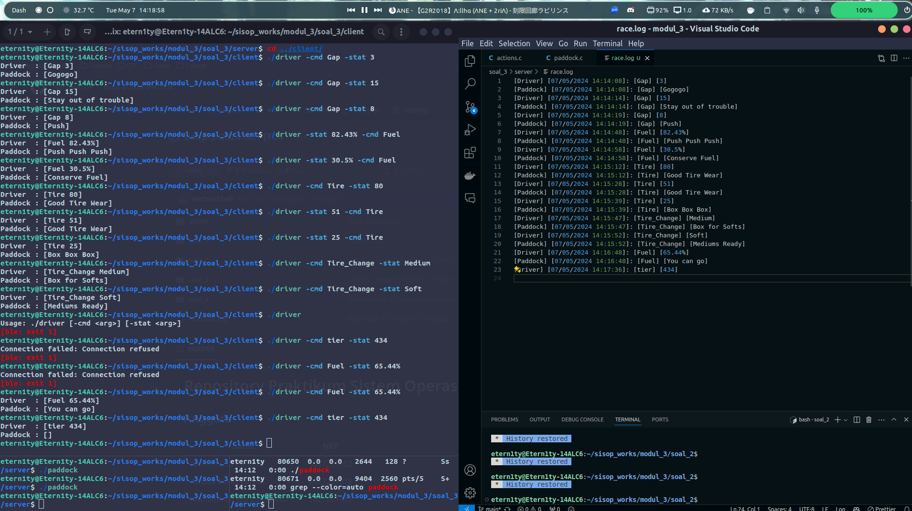
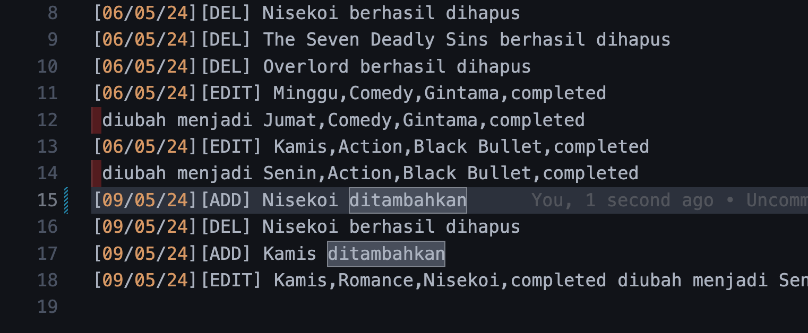

# Repository Praktikum Sistem Operasi Modul 3 - IT04

## Anggota

| Nama                      | NRP        |
| ------------------------- | ---------- |
| Nathan Kho Pancras        | 5027231002 |
| Athalla Barka Fadhil      | 5027231018 |
| Muhammad Ida Bagus Rafi H | 5027221059 |

## Daftar Isi

-   [Soal 1](#soal-1)
-   [Soal 2](#soal-2)
-   [Soal 3](#soal-3)
-   [Soal 4](#soal-4)

# Soal 1

# Soal 1

### Dikerjakan oleh Muhammad Ida Bagus Rafi Habibibie (5027221059)


## Deskripsi Soal

Pada zaman dahulu pada galaksi yang jauh-jauh sekali, hiduplah seorang Stelle. Stelle adalah seseorang yang sangat tertarik dengan Tempat Sampah dan Parkiran Luar Angkasa. Stelle memulai untuk mencari Tempat Sampah dan Parkiran yang terbaik di angkasa. Dia memerlukan program untuk bisa secara otomatis mengetahui Tempat Sampah dan Parkiran dengan rating terbaik di angkasa.**

## Pengerjaan

Jadi sesuai dengan permintaan soal,yakni Membuat Sistem Microservice untuk Menemukan Tempat Sampah dan Parkiran Luar Angkasa,dengan terdiri dari 3 program yang akan menjalankannya yakni,auth.c,db.c,dan rate.c

### Persiapan
* Buat struktur direktori yang akan digunakan untuk proyek ini. Struktur direktori awal akan terdiri dari tiga folder: `auth.c`, `microservices`, dan `new-data`.

```
├── auth.c
├── microservices
│   ├── database
│   └── db.c
├── rate.c
└── new-data
    ├── belobog_trashcan.csv
    ├── ikn.csv
    └── osaka_parkinglot.csv
```
* Persiapkan File-file Pendukung
    
    -   Siapkan file `auth.c`, `rate.c`, dan `db.c` di dalam direktori proyek.
    -   Siapkan file-file CSV dengan data Tempat Sampah dan Parkiran di dalam folder `new-data`,dengan isi filenya sebagai berikut:
    ```
    file belobog_trashcan.csv
    name, rating 
    Qlipoth Fort, 9.7 
    Everwinter Hill, 8.7 
    River Town, 6.8
    ```
    dan
    ```
    file Osaka_parkinglot.csv 
    name, rating 
    Dotonbori, 8.6 
    Kiseki, 9.7 
    Osaka Castle, 8.5
    ```
### Langkah Pengerjaan
1. ***Buatlah program `auth.c`***
yang akan mengautentikasi file yang masuk ke dalam folder `new-data`.
```c
#include <stdio.h>
#include <stdlib.h>
#include <string.h>
#include <dirent.h>
#include <sys/ipc.h>
#include <sys/shm.h>

#define MAX_FILENAME_LENGTH 256
#define SHM_SIZE 1024

int main() {
    DIR *dir;
    struct dirent *entry;
    dir = opendir("new-data");
    if (dir) {
        key_t key = ftok(".", 'a');
        int shmid = shmget(key, SHM_SIZE, IPC_CREAT | 0666);
        if (shmid == -1) {
            perror("shmget");
            exit(EXIT_FAILURE);
        }
        char *shm = shmat(shmid, NULL, 0);
        if (shm == (char *)-1) {
            perror("shmat");
            exit(EXIT_FAILURE);
        }
        
        while ((entry = readdir(dir)) != NULL) {
            char *filename = entry->d_name;
            int len = strlen(filename);
            if (len >= 17 && strcmp(filename + len - 17, "_trashcan.csv") == 0) {
                char command[MAX_FILENAME_LENGTH];
                sprintf(command, "cp new-data/%s Documents/microservices/database/%s", filename, filename);
                strcpy(shm, command);
            } else if (len >= 20 && strcmp(filename + len - 20, "_parkinglot.csv") == 0) {
                char command[MAX_FILENAME_LENGTH];
                sprintf(command, "cp new-data/%s Documents/microservices/database/%s", filename, filename);
                strcpy(shm, command);
            } else {
                char command[MAX_FILENAME_LENGTH];
                sprintf(command, "rm new-data/%s", filename);
                strcpy(shm, command);
            }
        }
        
       
        if (shmdt(shm) == -1) {
            perror("shmdt");
            exit(EXIT_FAILURE);
        }

       
        if (shmctl(shmid, IPC_RMID, NULL) == -1) {
            perror("shmctl");
            exit(EXIT_FAILURE);
        }
        
        closedir(dir);
    }

    return 0;
}


```
*   Pastikan program dapat mengidentifikasi file-file yang memenuhi kriteria autentikasi 
*  Jika file tidak memenuhi kriteria, program akan menghapusnya secara otomatis.
*  File-file yang lolos autentikasi akan dikirim ke shared memory untuk diproses oleh program lain.


2.  ***Implementasi Manajemen Basis Data pada `db.c`***
    
   *  Buat program `db.c` untuk memindahkan file dari folder `new-data` ke dalam folder `microservices/database`.
   ```c
   #include <stdio.h>
#include <stdlib.h>
#include <string.h>
#include <sys/ipc.h>
#include <sys/shm.h>
#include <time.h>

#define MAX_FILENAME_LENGTH 256
#define SHM_SIZE 1024

int main() {
    key_t key = ftok(".", 'b');

    int shmid = shmget(key, SHM_SIZE, 0666);
    if (shmid == -1) {
        perror("shmget");
        exit(EXIT_FAILURE);
    }
    char *shm = shmat(shmid, NULL, 0);
    if (shm == (char *)-1) {
        perror("shmat");
        exit(EXIT_FAILURE);
    }
    
    char command[MAX_FILENAME_LENGTH];
    strcpy(command, shm);
    system(command);
    
    if (shmdt(shm) == -1) {
        perror("shmdt");
        exit(EXIT_FAILURE);
    }

    char type[MAX_FILENAME_LENGTH];
    char filename[MAX_FILENAME_LENGTH];
    sscanf(command, "%*[^[][%[^]]] [%[^]]]", type, filename);

    FILE *fp;
    fp = fopen("microservices/database/db.log", "a");
    if (fp == NULL) {
        perror("Error opening file");
        exit(EXIT_FAILURE);
    }

    time_t rawtime;
    struct tm *timeinfo;
    time(&rawtime);
    timeinfo = localtime(&rawtime);

    fprintf(fp, "[%02d/%02d/%02d %02d:%02d:%02d] [%s] [%s]\n",
            timeinfo->tm_mday, timeinfo->tm_mon + 1, timeinfo->tm_year % 100,
            timeinfo->tm_hour, timeinfo->tm_min, timeinfo->tm_sec,
            type, filename);

    fclose(fp);

    return 0;
}


   ```
   
   * Proses pemindahan file menggunakan shared memory untuk berbagi informasi dengan program lain.
    * Setiap file yang dipindahkan akan dicatat ke dalam file `db.log`, mencatat waktu dan jenis (Trash Can atau Parking Lot) dari setiap file yang diproses.

3.***Implementasi Penilaian pada `rate.c`***
    
   * Buat program `rate.c` untuk mengambil data CSV dari shared memory.
   ```c
  #include <stdio.h>
#include <stdlib.h>
#include <string.h>

#define MAX_FILENAME_LENGTH 256

typedef struct {
    char name[MAX_FILENAME_LENGTH];
    float rating;
} Place;

void printBestPlace(Place place, const char *type) {
    printf("Type: %s\n", type);
    printf("Filename: %s\n", place.name);
    printf("------------------\n");
    printf("Name: %s\n", place.name);
    printf("Rating: %.1f\n", place.rating);
}

int main() {
    Place trashCan = {"", 0};
    Place parkingLot = {"", 0};

    FILE *file;
    char filename[MAX_FILENAME_LENGTH];
    float rating;
    char type[MAX_FILENAME_LENGTH];

    file = fopen("/Documents/microservices/database/belobog_trashcan.csv", "r");
    if (file) {
        while (fscanf(file, "%s %f", filename, &rating) == 2) {
            if (rating > trashCan.rating) {
                trashCan.rating = rating;
                strcpy(trashCan.name, filename);
            }
        }
        fclose(file);
    }

    file = fopen("/Documents/microservices/database/osaka_parkinglot.csv", "r");
    if (file) {
        while (fscanf(file, "%s %f", filename, &rating) == 2) {
            if (rating > parkingLot.rating) {
                parkingLot.rating = rating;
                strcpy(parkingLot.name, filename);
            }
        }
        fclose(file);
    }

    printBestPlace(trashCan, "Trash Can");
    printBestPlace(parkingLot, "Parking Lot");

    return 0;
} 
   ```
 
   * Program akan menampilkan Tempat Sampah dan Parkiran dengan rating terbaik dari data tersebut.
   * Output akan mencakup nama file, tipe (Trash Can atau Parking Lot), serta nama dan rating Tempat Sampah atau Parkiran terbaik.
   

4.***menjalankannya***
* Langkah 1: Kompilasi Program
Pastikan mengkompilasi setiap program menggunakan compiler C,menggunakan perintah berikut pada terminal:
```
gcc -o auth auth.c
gcc -o db db.c
gcc -o rate rate.c
```
* Langkah 2: Menjalankan Program `auth`
-Buka terminal dan pindahkan direktori kerja ke lokasi di mana file program `auth` berada.
 -Jalankan program `auth` dengan perintah berikut:
 ```
 ./auth
 ```
 -Program `auth` akan melakukan autentikasi file-file CSV di direktori `new-data` dan memindahkan file yang lulus autentikasi ke dalam shared memory.

* Menjalankan Program `db`

-Setelah program `auth` selesai dijalankan, buka terminal baru atau jalankan program `db` di terminal yang sama.   
-Pindahkan direktori kerja ke lokasi di mana file program `db` berada.   
-Jalankan program `db` dengan perintah berikut:
```
./db
```
       
 -Program `db` akan memindahkan file-file yang lulus autentikasi ke dalam direktori `microservices/database` dan mencatat setiap file yang masuk ke dalam file log `db.log`.
    

*Menjalankan Program `rate`
-Setelah program `db` selesai dijalankan, buka terminal baru atau jalankan -program `rate` di terminal yang sama.
-Pindahkan direktori kerja Anda ke lokasi di mana file program `rate` berada.
-Jalankan program `rate` dengan perintah berikut:
```
./rate
```
 -Program `rate` akan membaca data CSV dari shared memory dan mencetak tempat sampah dan parkiran dengan rating tertinggi.
 

 


# Soal 2

### Dikerjakan oleh Nathan Kho Pancras (5027231002)

## Deskripsi Soal

Max Verstappen 🏎️ seorang pembalap F1 dan programer memiliki seorang adik bernama Min Verstappen (masih SD) sedang menghadapi tahap paling kelam dalam kehidupan yaitu perkalian matematika, Min meminta bantuan Max untuk membuat kalkulator perkalian sederhana (satu sampai sembilan). Sembari Max nguli dia menyuruh Min untuk belajar perkalian dari web (referensi) agar tidak bergantung pada kalkulator.
(Wajib menerapkan konsep pipes dan fork seperti yang dijelaskan di modul Sisop. Gunakan 2 pipes dengan diagram seperti di modul 3).

### Catatan

Global variable yang digunakan untuk mempermudah pengerjaan:

```c
// Modes
volatile sig_atomic_t program_mode = 0;

// Inputted values
char input1[10];
char input2[10];
int num1, num2, result;

// Output
char strres[1024];

// Time variables
time_t T;
struct tm tm;
```

## Pengerjaan

> a. Sesuai request dari adiknya Max ingin nama programnya dudududu.c. Sebelum program parent process dan child process, ada input dari user berupa 2 string. Contoh input: tiga tujuh.

Karena input dipisah oleh spasi dan berakhir dengan enter, maka saya membuat scanf simple:

```c
scanf("%s%s", input1, input2);
    while((getchar()) != '\n');
```

> b. Pada parent process, program akan mengubah input menjadi angka dan melakukan perkalian dari angka yang telah diubah. Contoh: tiga tujuh menjadi 21.

Saya mengambil contoh kode penerapan pipe dari modul, kemudian saya pindah `scanf` tadi sebelum melakukan fork. Kemudian karena ini merupakan kalkulator, tetapi input kita bilangan di bahasa indonesia maka saya membuat fungsi untuk melakukan konversi dari str ke int seperti ini:

```c
int strint(char* str) {
    if (strcmp(str, "satu") == 0) return 1;
    else if (strcmp(str, "dua") == 0) return 2;
    else if (strcmp(str, "tiga") == 0) return 3;
    else if (strcmp(str, "empat") == 0) return 4;
    else if (strcmp(str, "lima") == 0) return 5;
    else if (strcmp(str, "enam") == 0) return 6;
    else if (strcmp(str, "tujuh") == 0) return 7;
    else if (strcmp(str, "delapan") == 0) return 8;
    else if (strcmp(str, "sembilan") == 0) return 9;
    else exit(EXIT_FAILURE);
}
```

Setelah itu saya membuat fungsi untuk operasi yang dilakukan, untuk sekarang perkalian.

```c
int opr_func() {
    return result = num1 * num2;
}
```

result, num1, dan num2 merupakan global variable, sehingga saya bisa melakukan:

```c
num1 = strint(input1);
num2 = strint(input2);
result = opr_func();
```

> c. Pada child process, program akan mengubah hasil angka yang telah diperoleh dari parent process menjadi kalimat. Contoh: `21` menjadi “dua puluh satu”.

Pertama saya masukkan result ke child process: `write(fd1[1], &result, sizeof(result));`.

Kemudian di child process saya read, `read(fd1[0], &result, sizeof(result));` dan karena result masih berbentuk int, saya membuat fungsi lagi untuk mengubah int ke str:

```c
char* intstr(int num) {
    if (num == 0) return "nol" ;
    else if (num == 1) return "satu";
    else if (num == 2) return "dua";
    else if (num == 3) return "tiga";
    else if (num == 4) return "empat";
    else if (num == 5) return "lima";
    else if (num == 6) return "enam";
    else if (num == 7) return "tujuh";
    else if (num == 8) return "delapan";
    else if (num == 9) return "sembilan";
    ...
    else if (num == 81) return "delapan puluh satu";
    else return "ERROR";
}
```

Karena operasi yang dilakukan memiliki batas 9\*9, maka saya buat fungsi ini untuk mengubah hanya sampai 81. Kemudian saya masukkan result ke fungsi ini, dan menggunakan strcpy untuk menyimpan result berbentuk str: `strcpy(strres, intstr(result));`

> d. Max ingin membuat program kalkulator dapat melakukan penjumlahan, pengurangan, dan pembagian, maka pada program buatlah argumen untuk menjalankan program :
>
> -   perkalian : ./kalkulator -kali
> -   penjumlahan : ./kalkulator -tambah
> -   pengurangan : ./kalkulator -kurang
> -   pembagian : ./kalkulator -bagi

Beberapa hari kemudian karena Max terpaksa keluar dari Australian Grand Prix 2024 membuat Max tidak bersemangat untuk melanjutkan programnya sehingga kalkulator yang dibuatnya cuma menampilkan hasil positif jika bernilai negatif maka program akan print “ERROR” serta cuma menampilkan bilangan bulat jika ada bilangan desimal maka dibulatkan ke bawah.

Untuk contoh argumen memakai 4 argumen di argv[1], sehingga kita bisa handle args dengan cara seperti berikut:

```c
if (argc == 1) {
        return 0;
    }
else if (argc > 1) {
    if (strcmp(argv[1], "-kali") == 0) {
        program_mode = 0;
    }
    else if (strcmp(argv[1], "-tambah") == 0) {
        program_mode = 1;
    }
    else if (strcmp(argv[1], "-kurang") == 0) {
        program_mode = 2;
    }
    else if (strcmp(argv[1], "-bagi") == 0) {
        program_mode = 3;
    }
}
```

Kemudian saya menambahkan operasi operasi yang lain kedalam `opr_func` dengan switch case berdasarkan program_mode:

```c
int opr_func() {
    switch (program_mode) {
        case 0:
            return result = num1 * num2;
        case 1:
            return result = num1 + num2;
        case 2:
            return result = num1 - num2;
        case 3:
            return result = num1 / num2;
    }
}
```

Sekarang program sudah bisa mengeksekusi operasi perkalian, penambahan, pengurangan, dan pembagian.

> e. Setelah diberi semangat, Max pun melanjutkan programnya dia ingin (pada child process) kalimat akan di print dengan contoh format :
>
> -   perkalian : “hasil perkalian tiga dan tujuh adalah dua puluh satu.”
> -   penjumlahan : “hasil penjumlahan tiga dan tujuh adalah sepuluh.”
> -   pengurangan : “hasil pengurangan tujuh dan tiga adalah empat.”
> -   pembagian : “hasil pembagian tujuh dan tiga adalah dua.”

Saya pun membuat switch case lagi menggunakan program_mode untuk menentukan output:

```c
char* output_type () {
    switch (program_mode) {
        case 0:
            return "perkalian";
        case 1:
            return "penjumlahan";
        case 2:
            return "pengurangan";
        case 3:
            return "pembagian";
        default:
            exit(EXIT_FAILURE);
    }
}
```

Kemudian kita lakukan printf terhadap hasil sesuai format soal:
`printf("hasil %s %s dan %s adalah %s\n", output_type(), input1, input2, strres);`

> f. Max ingin hasil dari setiap perhitungan dicatat dalam sebuah log yang diberi nama histori.log. Pada parent process, lakukan pembuatan file log berdasarkan data yang dikirim dari child process.
>
> -   Format: [date] [type] [message]
> -   Type: KALI, TAMBAH, KURANG, BAGI
> -   Ex:

```
[10/03/24 00:29:47] [KALI] tujuh kali enam sama dengan empat puluh dua.
[10/03/24 00:30:00] [TAMBAH] sembilan tambah sepuluh sama dengan sembilan belas.
[10/03/24 00:30:12] [KURANG] ERROR pada pengurangan.
```

Pertama saya menambahkan `write(fd2[1], strres, strlen(strres)+1);` di child process sebelum close, kemudian menambahkan `read(fd2[0], strres, sizeof(strres));` di parent process untuk melakukan logging.

Saya inisialisasikan dulu global variable T dan tm:

```c
T = time(NULL);
tm = *localtime(&T);
```

Sekarang saya melakukan fopen biasa:

```c
FILE *log = fopen("history.log", "a");
        if (log != NULL) {
            if (strcmp(strres, "ERROR") == 0) {
                fprintf(log, "[%02d/%02d/%02d %02d:%02d:%02d] [%s] ERROR pada %s\n", tm.tm_mday, tm.tm_mon + 1, tm.tm_year + 1900, tm.tm_hour, tm.tm_min, tm.tm_sec, log_out(), output_type());
            }
            else {
                if (program_mode == 0) fprintf(log, "[%02d/%02d/%02d %02d:%02d:%02d] [%s] %s kali %s sama dengan %s\n", tm.tm_mday, tm.tm_mon + 1, tm.tm_year + 1900, tm.tm_hour, tm.tm_min, tm.tm_sec, log_out(), input1, input2, strres);
                else if (program_mode == 1) fprintf(log, "[%02d/%02d/%02d %02d:%02d:%02d] [%s] %s tambah %s sama dengan %s\n", tm.tm_mday, tm.tm_mon + 1, tm.tm_year + 1900, tm.tm_hour, tm.tm_min, tm.tm_sec, log_out(), input1, input2, strres);
                else if (program_mode == 2) fprintf(log, "[%02d/%02d/%02d %02d:%02d:%02d] [%s] %s kurang %s sama dengan %s\n", tm.tm_mday, tm.tm_mon + 1, tm.tm_year + 1900, tm.tm_hour, tm.tm_min, tm.tm_sec, log_out(), input1, input2, strres);
                else if (program_mode == 3) fprintf(log, "[%02d/%02d/%02d %02d:%02d:%02d] [%s] %s bagi %s sama dengan %s\n", tm.tm_mday, tm.tm_mon + 1, tm.tm_year + 1900, tm.tm_hour, tm.tm_min, tm.tm_sec, log_out(), input1, input2, strres);
            }
            fclose(log);
        }
        else {
            perror("Failed to open log file");
            exit(EXIT_FAILURE);
        }
```

Dimana output juga dipengaruhi oleh program_mode.

## Output


# Soal 3

### Dikerjakan oleh Nathan Kho Pancras (5027231002)

## Deskripsi Soal

Shall Leglerg🥶 dan Carloss Signs 😎 adalah seorang pembalap F1 untuk tim Ferrari 🥵. Mobil F1 memiliki banyak pengaturan, seperti penghematan ERS, Fuel, Tire Wear dan lainnya. Pada minggu ini ada race di sirkuit Silverstone. Malangnya, seluruh tim Ferrari diracun oleh Super Max Max pada hari sabtu sehingga seluruh kru tim Ferrari tidak bisa membantu Shall Leglerg🥶 dan Carloss Signs 😎 dalam race. Namun, kru Ferrari telah menyiapkan program yang bisa membantu mereka dalam menyelesaikan race secara optimal. Program yang dibuat bisa mengatur pengaturan - pengaturan dalam mobil F1 yang digunakan dalam balapan.

### Catatan

Directory:

```
├── client
│   └── driver.c
└── server
    ├── actions.c
    ├── paddock.c
    └── race.log
```

Port yang digunakan: 8080
IP: 127.0.0.1

Defined variables:
`#define MAX_LEN 1024`

## Pengerjaan

> a. Pada program actions.c, program akan berisi function function yang bisa di call oleh paddock.c

> b. Action berisikan sebagai berikut:
>
> -   Gap [Jarak dengan driver di depan (float)]: Jika Jarak antara Driver dengan Musuh di depan adalah < 3.5s maka return Gogogo, jika jarak > 3.5s dan 10s return Push, dan jika jarak > 10s maka return Stay out of trouble.
> -   Fuel [Sisa Bensin% (string/int/float)]: Jika bensin lebih dari 80% maka return Push Push Push, jika bensin di antara 50% dan 80% maka return You can go, dan jika bensin kurang dari 50% return Conserve Fuel.
> -   Tire [Sisa Ban (int)]: Jika pemakaian ban lebih dari 80 maka return Go Push Go Push, jika pemakaian ban diantara 50 dan 80 return Good Tire Wear, jika pemakaian di antara 30 dan 50 return Conserve Your Tire, dan jika pemakaian ban kurang dari 30 maka return Box Box Box.
> -   Tire Change [Tipe ban saat ini (string)]: Jika tipe ban adalah Soft return Mediums Ready, dan jika tipe ban Medium return Box for Softs.

    	Contoh:
    	[Driver] : [Fuel] [55%]
    	[Paddock]: [You can go]

Sesuai soal, saya membuat functions untuk tiap kasus:

```c
char* gap_func(float gap) {
    if (gap <= 3.5) return "Gogogo";
    else if (gap <= 10) return "Push";
    else return "Stay out of trouble";
}

char* fuel_func(float fuel) {
    if (fuel > 80) return "Push Push Push";
    else if (fuel >= 50) return "You can go";
    else return "Conserve Fuel";
}

char* tire_func(int tire) {
    if (tire > 80) return "Go Push Go Push";
    else if (tire >= 50) return "Good Tire Wear";
    else if (tire > 30) return "Conserve Your Tire";
    else return "Box Box Box";
}

char* tire_change(char* type) {
    if (strcmp(type, "Soft") == 0) return "Mediums Ready";
    else if (strcmp(type, "Medium") == 0) return "Box for Softs";
}
```

> c. Pada paddock.c program berjalan secara daemon di background, bisa terhubung dengan driver.c melalui socket RPC.

Karena paddock berjalan sebagai daemon dan bertindak sebagai server, maka saya pertama mengambil kode RPC server dari modul kemudian kode untuk membuat program menjadi daemon setelah dilakukan listen di port yang ditentukan (8080), dan untuk accept sampai output dilakukan didalam while(1).

> d. Program paddock.c dapat call function yang berada di dalam actions.c.

```c
// ... (kode modul untuk RPC)

if (listen(serv_socket, 3) < 0) {
    perror("Listen failed");
    exit(EXIT_FAILURE);
}

// ... (kode modul untuk daemon)

while (1) {
    // accept
    // read buffer

    // pemangillan actions.c sesuai argv yang akan dilakukan nanti
}
```

> e. Program paddock.c tidak keluar/terminate saat terjadi error dan akan log semua percakapan antara paddock.c dan driver.c di dalam file race.log
>
> Format log:

```log
[Source] [DD/MM/YY hh:mm:ss]: [Command] [Additional-info]
ex :
[Driver] [07/04/2024 08:34:50]: [Fuel] [55%]
[Paddock] [07/04/2024 08:34:51]: [Fuel] [You can go]
```

> f. Program driver.c bisa terhubung dengan paddock.c dan bisa mengirimkan pesan dan menerima pesan serta menampilan pesan tersebut dari paddock.c sesuai dengan perintah atau function call yang diberikan.

> h. Untuk mengaktifkan RPC call dari driver.c, bisa digunakan in-program CLI atau Argv (bebas) yang penting bisa send command seperti poin B dan menampilkan balasan dari paddock.c
> Contoh:

```bash
Argv:
./driver -c Fuel -i 55%
in-program CLI:
Command: Fuel
Info: 55%
```

Saya memutuskan untuk memakai argv untuk soal ini.

Paddock:

```c
char cmd[MAX_LEN], stat[MAX_LEN], *resp;
    int mark;

while (1) {
    // accept incoming connection...

    // clear buffer + read
    memset(buffer, 0, MAX_LEN);
    int cli_buf = read(cli_socket, buffer, MAX_LEN);
    if (cli_buf < 0) {
        perror("Read failed");
        break;
    }
    else if (cli_buf == 0) {
        break;
    }

    resp = NULL;
    mark = 1;

    // Handling args
    sscanf(buffer, "%s %s", cmd, stat);
    if (strcmp(cmd, "Gap") == 0) {
        float cur_gap = atof(stat);
        resp = gap_func(cur_gap);
    }
    else if (strcmp(cmd, "Fuel") == 0) {
        float cur_fuel = atof(stat);
        resp = fuel_func(cur_fuel);
    }
    else if (strcmp(cmd, "Tire") == 0) {
        int cur_tire = atoi(stat);
        resp = tire_func(cur_tire);
    }
    else if (strcmp(cmd, "Tire_Change") == 0) {
        resp = tire_change(stat);
    }
    else {
        mark = 0;
    }

    log_func("Driver", cmd, stat);
    if (mark) {
        log_func("Paddock", cmd, resp);
    }

    if (resp != NULL && send(cli_socket, resp, strlen(resp), 0) < 0){
        perror("Send buffer failed");
    };

    close(cli_socket);
    sleep(5);
}
```

Penggunaan strcmp dilakukan untuk membandingkan arg yang diterima dari client yaitu driver kemudian melakukan fungsi yang sesuai. Log untuk paddock dijalankan hanya ketika paddock masuk ke salah satu if else, jika tidak maka hanya log driver yang dicatat. Kemudian dilakukan send buffer untuk response ke client kembali.

Driver:

```c
int main(int argc, char *argv[]) {
    // RPC client (Modul)

    char buf[MAX_LEN], resp[MAX_LEN];
    char space = ' ';
    char arg1[MAX_LEN];

    if (argc < 5) {
        printf("Usage: %s [-cmd <arg>] [-stat <arg>]\n", argv[0]);
        exit(EXIT_FAILURE);
    }

    // Pengecekan posisi arg yang berbeda, sehingga:
    // -cmd ... -stat ... dan -stat ... -cmd ... sama sama bekerja,
    // seperti program yang menggunakan argv pada umumnya

    else if ((strcmp(argv[1], "-cmd") == 0 && strcmp(argv[3], "-stat") == 0) || (strcmp(argv[1], "-stat") == 0 && strcmp(argv[3], "-cmd") == 0)) {
        if (strcmp(argv[1], "-cmd") == 0) {
            strcpy(arg1, argv[2]);
            strncat(arg1, &space, 1);
            strcpy(buf, strcat(arg1, argv[4]));
        }
        else {
            strcpy(arg1, argv[4]);
            strncat(arg1, &space, 1);
            strcpy(buf, strcat(arg1, argv[2]));
        }

        // send buffer
        printf("Driver  : [%s]\n", buf);
        send(sock, buf, strlen(buf), 0);
        memset(resp, 0, MAX_LEN);

        // read response -> output
        int ser_buf = read(sock, resp, MAX_LEN);
        resp[ser_buf] = '\0';
        printf("Paddock : [%s]\n", resp);
    }
    return 0;
}
```

Untuk cara menggunakan driver, menggunakan argumen -cmd dan -stat, dimana cmd yaitu command yang dipass ke paddock, dan stat yaitu status dari command yang diberikan. Kemudian dilakukan send dan read response ke paddock untuk output dan log.

> g. Jika bisa digunakan antar device/os (non local) akan diberi nilai tambahan.

Dilakukan penambahan di driver.c

```c
#include <netdb.h>
#include <netinet/in.h>

#define IP "192.168.1.21" // cek ip host - ifconfig

int main(int argc, char *argv[]) {
// ...
struct hostent *address;
// ...

if (sock < 0) {
        perror("Error opening socket");
        address = gethostbyname(IP);
        if (address == NULL) {
            fprintf(stderr, "ERROR, no such host\n");
            exit(EXIT_FAILURE);
        }
    }
// ...
}
```

## Output



# Soal 4

## Deskripsi Soal

Lewis Hamilton 🏎 seorang wibu akut dan sering melewatkan beberapa episode yang karena sibuk menjadi asisten. Maka dari itu dia membuat list anime yang sedang ongoing (biar tidak lupa) dan yang completed (anime lama tapi pengen ditonton aja). Tapi setelah Lewis pikir-pikir malah kepikiran untuk membuat list anime. Jadi dia membuat file (harap diunduh) dan ingin menggunakan socket yang baru saja dipelajarinya untuk melakukan CRUD pada list animenya.

### Catatan

```bash
soal_4
├── client
│ └── client.c
└── server
└── server.c
```

## Pengerjaan

**File: server.c**

1. **Bagian Include dan Define**

```c
#include <stdio.h>
#include <sys/socket.h>
#include <stdlib.h>
#include <netinet/in.h>
#include <string.h>
#include <unistd.h>
#include <time.h>

#define BUFFER_SIZE 1024
#define PORT 8080
```

Bagian ini melakukan include terhadap library yang diperlukan untuk program server dan mendefinisikan konstanta `BUFFER_SIZE` untuk ukuran buffer dan `PORT` untuk nomor port yang digunakan.

2. **Fungsi get_new_anime**

```c
char* get_new_anime(const char* buffer) {
  char* anime_info;
  char* token;
  char buffer_copy[strlen(buffer) + 1]; // Salin string buffer ke buffer_copy

  // Salin string buffer ke buffer_copy
  strcpy(buffer_copy, buffer);

  // Memulai pemisahan string menggunakan strtok
  token = strtok(buffer_copy, ",");
  // Melakukan pemisahan string sampai menemukan token kedua
  for (int i = 0; i < 1; i++) {
    token = strtok(NULL, ",");
  }

  // Mengalokasikan memori untuk string anime_info
  anime_info = (char*)malloc(strlen(token) + 1);
  if (anime_info == NULL) {
    printf("Memory allocation failed\n");
    return NULL;
  }

  // Menyalin token kedua dan token-token berikutnya ke dalam string anime_info
  strcpy(anime_info, token);
  while ((token = strtok(NULL, ",")) != NULL) {
    strcat(anime_info, ",");
    strcat(anime_info, token);
  }

  // Mengembalikan string anime_info
  return anime_info;
}
```

Fungsi ini mengambil string `buffer` sebagai input dan mengembalikan informasi anime baru yang diekstrak dari token kedua dan seterusnya setelah dipisahkan dengan koma.

3. **Fungsi get_anime_info**

```c
char* get_anime_info(const char* anime_name, const char* csv_file, int sock) {
  char command[BUFFER_SIZE];
  char result[BUFFER_SIZE];

  // Format perintah awk untuk mencari nama anime tertentu dalam file CSV
  snprintf(command, BUFFER_SIZE, "awk -F, '$3 == \"%s\" { print }' %s", anime_name, csv_file);

  // Menjalankan perintah awk dan menangkap outputnya
  FILE* fp = popen(command, "r");
  if (fp == NULL) {
    perror("popen failed");
    exit(EXIT_FAILURE);
  }
  // Membaca output dari perintah awk dan menyimpannya dalam variabel result
  if (fgets(result, sizeof(result), fp) == NULL) {
    char* invalid = "Invalid Command\n";
    send(sock, invalid, strlen(invalid), 0);
  }

  // Menutup pipa yang terhubung dengan perintah awk
  pclose(fp);

  // Menghapus karakter newline dari akhir string jika ada
  result[strcspn(result, "\n")] = 0;

  // Mengembalikan hasil pencarian
  return strdup(result);
}
```

Fungsi ini mencari informasi anime tertentu dalam file CSV dengan menggunakan perintah `awk`. Jika anime ditemukan, fungsi akan mengembalikan informasi anime dalam bentuk string.

4. **Fungsi get_anime_name**

```c
char* get_anime_name(const char* buffer, int index) {
  // Buat salinan string buffer untuk diproses
  char* buffer_copy = strdup(buffer);

  // Deklarasi variabel token dan pointer nama anime
  char* token = NULL;
  char* anime_name = NULL;

  // Pemisahan string menggunakan strtok
  token = strtok(buffer_copy, " ");
  token = strtok(NULL, ",");
  // Melompati token-tokem sebelumnya untuk mencapai token yang diinginkan
  for (int i = 0; i < index; i++) {
    token = strtok(NULL, ",");
    // Memeriksa apakah token telah mencapai akhir string atau tidak
    if (token == NULL) {
      // Jika token tidak ditemukan, dealokasikan memori yang dialokasikan untuk buffer_copy dan kembalikan NULL
      free(buffer_copy);
      return NULL;
    }
  }

  // Alokasikan memori untuk nama anime dan salin token ke dalamnya
  anime_name = strdup(token);

  // Dealokasi memori yang dialokasikan untuk buffer_copy
  free(buffer_copy);
  // Kembalikan pointer ke nama anime
  return anime_name;
}
```

Fungsi ini mengambil string `buffer` dan `index` sebagai input dan mengembalikan nama anime pada indeks tertentu setelah dipisahkan dengan koma.

5. **Fungsi send_command_output**

```c
void send_command_output(int sock, const char* command) {
  // Menjalankan perintah sistem dan menangkap outputnya
  FILE* fp;
  char output[BUFFER_SIZE] = { 0 };
  char full_output[8192] = { 0 }; // Menampung seluruh output dalam satu string
  fp = popen(command, "r");
  if (fp == NULL) {
    printf("Failed to run command\n");
    return;
  }
  while (fgets(output, sizeof(output), fp) != NULL) {
    // Menggabungkan setiap baris output ke dalam string penuh
    strcat(full_output, output);
  }
  // Mengirimkan seluruh output ke client dalam satu pesan
  send(sock, full_output, strlen(full_output), 0);
  pclose(fp);
}
```

Fungsi ini menjalankan perintah sistem yang diberikan dan mengirimkan outputnya ke client melalui socket.

6. **Fungsi log_command**

```c
void log_command(const char* action, const char* cmd, int sock) {
  // Buka file log
  FILE* log_file = fopen("../change.log", "a");
  if (log_file == NULL) {
    perror("Failed to open log file");
    return;
  }

  // Mendapatkan waktu saat ini
  time_t now;
  struct tm* local_time;
  char timestamp[30];
  time(&now);
  local_time = localtime(&now);
  strftime(timestamp, sizeof(timestamp), "%d/%m/%y", local_time);

  char* anime_name = get_anime_name(cmd, 0);
  // Menulis log ke file
  if (strcmp(action, "add") == 0) {
    fprintf(log_file, "[%s][ADD] %s ditambahkan\n", timestamp, anime_name);
  }

  if (strcmp(action, "edit") == 0) {
    char* old_anime_name = get_anime_name(cmd, 0);
    char* old_anime = get_anime_info(old_anime_name, "../myanimelist.csv", sock);

    char* new_anime = get_new_anime(cmd);

    fprintf(log_file, "[%s][EDIT] %s diubah menjadi %s\n", timestamp, old_anime, new_anime);
  }
  if (strcmp(action, "delete") == 0) {
    fprintf(log_file, "[%s][DEL] %s berhasil dihapus\n", timestamp, anime_name);
  }

  // Menutup file log
  fclose(log_file);
}
```

Fungsi ini mencatat tindakan (add, edit, delete) pada file log dengan informasi waktu, nama anime, dan informasi lainnya.

7. **Fungsi main**

```c
int main(int argc, char const* argv[]) {
  int server_fd, new_socket, valread;
  struct sockaddr_in address;
  int opt = 1;
  int addrlen = sizeof(address);
  char buffer[BUFFER_SIZE] = { 0 };
  char* hello = "Hello from server";
```

Pada bagian ini, program mendeklarasikan variabel-variabel yang diperlukan untuk menginisialisasi socket server dan menerima koneksi dari client. Variabel `server_fd` adalah file deskriptor untuk socket server, `new_socket` adalah file deskriptor untuk socket baru yang menerima koneksi dari client, `valread` digunakan untuk menyimpan jumlah byte yang dibaca dari socket, `address` adalah struktur yang menyimpan informasi alamat socket, `opt` adalah variabel flag untuk mengatur opsi socket, `addrlen` adalah ukuran struktur alamat, `buffer` adalah buffer untuk menyimpan data yang diterima dari client, dan `hello` adalah string yang tidak digunakan dalam kode ini.

```c
if ((server_fd = socket(AF_INET, SOCK_STREAM, 0)) == 0) {
  perror("socket failed");
  exit(EXIT_FAILURE);
}
```

Baris ini membuat socket baru dengan menggunakan fungsi `socket`. Argumen yang diberikan adalah `AF_INET` (alamat IPv4), `SOCK_STREAM` (tipe socket TCP), dan `0` (protokol default). Jika pembuatan socket gagal, program akan mencetak pesan error dan keluar.

```c
if (setsockopt(server_fd, SOL_SOCKET, SO_REUSEADDR, &opt, sizeof(opt))) {
  perror("setsockopt");
  exit(EXIT_FAILURE);
}
```

Baris ini mengatur opsi socket menggunakan fungsi `setsockopt`. Opsi yang diatur adalah `SO_REUSEADDR`, yang memungkinkan socket untuk mengikat ke alamat yang sebelumnya digunakan oleh socket lain. Jika pengaturan opsi gagal, program akan mencetak pesan error dan keluar.

```c
address.sin_family = AF_INET;
address.sin_addr.s_addr = INADDR_ANY;
address.sin_port = htons(PORT);
```

Baris-baris ini mengatur struktur `address` dengan informasi alamat socket yang akan digunakan. `sin_family` diatur ke `AF_INET` (alamat IPv4), `sin_addr.s_addr` diatur ke `INADDR_ANY` (mendengarkan pada semua antarmuka jaringan), dan `sin_port` diatur ke `htons(PORT)` (mengubah nomor port ke format network byte order).

```c
if (bind(server_fd, (struct sockaddr*)&address, sizeof(address)) < 0) {
  perror("bind failed");
  exit(EXIT_FAILURE);
}
```

Baris ini mengikat socket `server_fd` dengan alamat yang telah diatur sebelumnya menggunakan fungsi `bind`. Jika proses binding gagal, program akan mencetak pesan error dan keluar.

```c
if (listen(server_fd, 3) < 0) {
  perror("listen");
  exit(EXIT_FAILURE);
}
```

Baris ini memasukkan socket `server_fd` ke dalam mode listening (mendengarkan koneksi masuk) menggunakan fungsi `listen`. Argumen kedua adalah backlog, yang menentukan jumlah maksimum koneksi yang dapat ditampung dalam antrian sambungan. Jika proses listening gagal, program akan mencetak pesan error dan keluar.

```c
if ((new_socket = accept(server_fd, (struct sockaddr*)&address, (socklen_t*)&addrlen)) < 0) {
  perror("accept");
  exit(EXIT_FAILURE);
}
```

Baris ini menerima koneksi masuk dari client menggunakan fungsi `accept`. Fungsi ini akan memblokir hingga ada koneksi masuk. Jika koneksi diterima, `new_socket` akan menyimpan file deskriptor untuk socket baru yang terhubung dengan client. Jika proses penerimaan koneksi gagal, program akan mencetak pesan error dan keluar.

```c
while (1) {
  valread = read(new_socket, buffer, BUFFER_SIZE);
  buffer[valread] = '\0'; // Menambahkan null-terminator ke akhir string yang dibaca

  if (valread > 0) {
    if (strcmp(buffer, "exit") == 0) {
      printf("Received: %s\n", buffer);
      char* exit = "\nExiting the client\n";
      send(new_socket, exit, strlen(exit), 0);
      break; // Keluar dari loop
    }
```

Blok kode di atas merupakan bagian dari loop `while` yang berjalan secara terus-menerus. Pada setiap iterasi, program membaca data dari `new_socket` (socket yang terhubung dengan client) menggunakan fungsi `read` dan menyimpan data yang dibaca dalam `buffer`. Kemudian, program menambahkan null-terminator (`\0`) ke akhir string yang dibaca.

Jika ada data yang berhasil dibaca (`valread > 0`), program akan memeriksa apakah data tersebut adalah perintah "exit". Jika benar, program akan mencetak perintah yang diterima, mengirimkan pesan "Exiting the client" ke client menggunakan fungsi `send`, dan keluar dari loop `while` menggunakan pernyataan `break`.

```c
else if (strcmp(buffer, "tampilkan") == 0) {
  char command[200] = "cat ../myanimelist.csv | awk -F, '{print NR \". \" $3}'";
  printf("Received: %s\n\n", buffer);
  send_command_output(new_socket, command);
}
```

Jika perintah yang diterima bukan "exit", program akan memeriksa apakah perintah tersebut adalah "tampilkan". Jika benar, program akan mencetak perintah yang diterima, dan memanggil fungsi `send_command_output` dengan argumen `new_socket` (socket yang terhubung dengan client) dan `command` (perintah untuk menampilkan daftar anime dari file CSV).

```c
else if (strncmp(buffer, "hari ", 5) == 0) {
  char* hari = buffer + 5; // Mengambil string setelah "hari "
  char command[100];
  sprintf(command, "grep '^%s,' ../myanimelist.csv | awk -F, '{print NR \". \" $3}'", hari);
  printf("Received: %s\n\n", buffer);
  send_command_output(new_socket, command);
}
```

Jika perintah yang diterima dimulai dengan "hari ", program akan mengambil string setelah "hari " (hari yang ingin dicari) dan menyimpannya dalam variabel `hari`. Kemudian, program membangun perintah untuk mencari anime berdasarkan hari dalam file CSV menggunakan `grep` dan `awk`, mencetak perintah yang diterima, dan memanggil fungsi `send_command_output` dengan argumen `new_socket` dan `command`.

```c
else if (strncmp(buffer, "genre ", 6) == 0) {
  char* genre = buffer + 6; // Mengambil string setelah "genre "
  char command[100];
  sprintf(command, "grep ',%s,' ../myanimelist.csv | awk -F, '{print NR \". \" $3}'", genre);
  printf("Received: %s\n\n", buffer);
  send_command_output(new_socket, command);
}
```

Blok kode ini mirip dengan blok sebelumnya, tetapi untuk mencari anime berdasarkan genre. Jika perintah yang diterima dimulai dengan "genre ", program akan mengambil string setelah "genre " (genre yang ingin dicari) dan menyimpannya dalam variabel `genre`. Kemudian, program membangun perintah untuk mencari anime berdasarkan genre dalam file CSV menggunakan `grep` dan `awk`, mencetak perintah yang diterima, dan memanggil fungsi `send_command_output` dengan argumen `new_socket` dan `command`.

```c
else if (strncmp(buffer, "add ", 4) == 0) {
  char* data = buffer + 4;
  char command[100];
  sprintf(command, "echo \"%s\" >> ../myanimelist.csv", data);
  printf("Received: %s\n\n", buffer);
  send_command_output(new_socket, command);
  log_command("add", buffer, new_socket);
  char* comment = "Anime berhasil ditambahkan\n";
  send(new_socket, comment, strlen(comment), 0);
}
```

Blok kode ini menangani perintah "add" untuk menambahkan anime baru ke dalam file CSV. Jika perintah yang diterima dimulai dengan "add ", program akan mengambil string setelah "add " (data anime yang akan ditambahkan) dan menyimpannya dalam variabel `data`. Kemudian, program membangun perintah untuk menambahkan data anime ke file CSV menggunakan `echo`, mencetak perintah yang diterima, dan memanggil fungsi `send_command_output` dengan argumen `new_socket` dan `command`.

Setelah itu, program memanggil fungsi `log_command` dengan argumen "add", `buffer` (perintah yang diterima), dan `new_socket` (socket yang terhubung dengan client). Fungsi `log_command` digunakan untuk mencatat tindakan penambahan anime ke dalam file log.

Terakhir, program mengirimkan pesan "Anime berhasil ditambahkan" ke client menggunakan fungsi `send`.

```c
else if (strncmp(buffer, "status ", 7) == 0) {
  char* name = buffer + 7;
  char command[100];
  sprintf(command, "grep ',%s,' ../myanimelist.csv | awk -F, '{print $4}'", name);
  printf("Received: %s\n\n", buffer);
  send_command_output(new_socket, command);
}
```

Blok kode ini menangani perintah "status" untuk menampilkan status anime tertentu dari file CSV. Jika perintah yang diterima dimulai dengan "status ", program akan mengambil string setelah "status " (nama anime yang ingin dicari statusnya) dan menyimpannya dalam variabel `name`. Kemudian, program membangun perintah untuk mencari status anime dalam file CSV menggunakan `grep` dan `awk`, mencetak perintah yang diterima, dan memanggil fungsi `send_command_output` dengan argumen `new_socket` dan `command`.

```c
else if (strncmp(buffer, "edit ", 5) == 0) {
  char* input = buffer + 5;
  char command[250];

  log_command("edit", buffer, new_socket);
  printf("Received: %s\n\n", buffer);
  // Pisahkan input berdasarkan koma
  char* anime = strtok(input, ",");
  char* hari = strtok(NULL, ",");
  char* genre = strtok(NULL, ",");
  char* judul = strtok(NULL, ",");
  char* status = strtok(NULL, ",");
  // Membangun perintah untuk mengedit file CSV menggunakan perintah awk
  sprintf(command, "awk -F, '{ if ($3 == \"%s\") { print \"%s,%s,%s,%s\" } else { print $0 } }' ../myanimelist.csv > temp.csv && mv temp.csv ../myanimelist.csv", anime, hari, genre, judul, status);

  send_command_output(new_socket, command);

  char* comment = "Anime berhasil diedit\n";
  send(new_socket, comment, strlen(comment), 0);
}
```

Blok kode ini menangani perintah "edit" untuk mengubah informasi anime dalam file CSV. Jika perintah yang diterima dimulai dengan "edit ", program akan mengambil string setelah "edit " (data anime yang akan diedit) dan menyimpannya dalam variabel `input`. Kemudian, program memanggil fungsi `log_command` dengan argumen "edit", `buffer` (perintah yang diterima), dan `new_socket` (socket yang terhubung dengan client). Fungsi `log_command` digunakan untuk mencatat tindakan pengubahan anime ke dalam file log.

Selanjutnya, program memisahkan `input` berdasarkan koma menggunakan fungsi `strtok` dan menyimpan masing-masing bagian dalam variabel `anime`, `hari`, `genre`, `judul`, dan `status`. Kemudian, program membangun perintah untuk mengedit file CSV menggunakan perintah `awk`, di mana baris yang mengandung nama anime tertentu akan diganti dengan data baru yang diberikan.

Setelah itu, program memanggil fungsi `send_command_output` dengan argumen `new_socket` dan `command` untuk menjalankan perintah dan mengirimkan hasilnya ke client.

Terakhir, program mengirimkan pesan "Anime berhasil diedit" ke client menggunakan fungsi `send`.

**File: client.c**

```c
#include <stdio.h>
#include <sys/socket.h>
#include <stdlib.h>
#include <netinet/in.h>
#include <string.h>
#include <unistd.h>
#include <arpa/inet.h>
#include <string.h>

#define PORT 8080
```

Bagian ini adalah bagian include yang memasukkan library-library yang diperlukan untuk program client, seperti `stdio.h` untuk operasi input/output, `sys/socket.h` untuk penggunaan socket, dan lain-lain. Selain itu, ada juga definisi konstanta `PORT` yang menyimpan nomor port yang akan digunakan untuk komunikasi dengan server.

```c
int main(int argc, char const* argv[]) {
  struct sockaddr_in address;
  int sock = 0, valread;
  struct sockaddr_in serv_addr;
  char* hello = "Hello from client";
  char buffer[1024] = { 0 };
```

Ini adalah awal dari fungsi `main`, yang merupakan titik masuk program. Pada bagian ini, program mendeklarasikan variabel-variabel yang diperlukan, seperti `address` (struktur yang menyimpan informasi alamat socket), `sock` (file deskriptor untuk socket client), `valread` (untuk menyimpan jumlah byte yang dibaca dari socket), `serv_addr` (struktur alamat server), `hello` (string yang tidak digunakan dalam program ini), dan `buffer` (buffer untuk menyimpan data yang diterima dari server).

```c
if ((sock = socket(AF_INET, SOCK_STREAM, 0)) < 0) {
  printf("\n Socket creation error \n");
  return -1;
}
```

Baris ini membuat socket baru dengan menggunakan fungsi `socket`. Argumen yang diberikan adalah `AF_INET` (alamat IPv4), `SOCK_STREAM` (tipe socket TCP), dan `0` (protokol default). Jika pembuatan socket gagal, program akan mencetak pesan error dan keluar dengan mengembalikan nilai -1.

```c
memset(&serv_addr, '0', sizeof(serv_addr));

serv_addr.sin_family = AF_INET;
serv_addr.sin_port = htons(PORT);

if (inet_pton(AF_INET, "127.0.0.1", &serv_addr.sin_addr) <= 0) {
  printf("\nInvalid address/ Address not supported \n");
  return -1;
}
```

Baris-baris ini mengatur struktur `serv_addr` dengan informasi alamat server yang akan dihubungi. `memset` digunakan untuk mengisi `serv_addr` dengan nilai 0. Kemudian, `sin_family` diatur ke `AF_INET` (alamat IPv4), `sin_port` diatur ke `htons(PORT)` (mengubah nomor port ke format network byte order), dan `sin_addr` diatur ke alamat localhost ("127.0.0.1") menggunakan fungsi `inet_pton`. Jika pengaturan alamat gagal, program akan mencetak pesan error dan keluar dengan mengembalikan nilai -1.

```c
if (connect(sock, (struct sockaddr*)&serv_addr, sizeof(serv_addr)) < 0) {
  printf("\nConnection Failed \n");
  return -1;
}
```

Baris ini mencoba untuk membuat koneksi dengan server menggunakan fungsi `connect`. Jika koneksi gagal, program akan mencetak pesan error dan keluar dengan mengembalikan nilai -1.

```c
char cmd[100];

while (1) {
  printf("\nYou: ");
  scanf("%[^\n]", cmd);
  getchar(); // Membersihkan karakter newline dari buffer stdin

  if (strlen(cmd) > 0) {
    send(sock, cmd, strlen(cmd), 0);
```

Setelah berhasil terhubung dengan server, program memasuki loop `while` yang berjalan terus-menerus. Pada setiap iterasi, program meminta pengguna memasukkan perintah melalui `scanf` dan menyimpannya dalam variabel `cmd`. Kemudian, program mengecek apakah perintah yang dimasukkan tidak kosong (`strlen(cmd) > 0`). Jika tidak kosong, program mengirimkan perintah ke server menggunakan fungsi `send`.

```c
char full_output[8192] = { 0 }; // Menampung seluruh output dalam satu string
valread = read(sock, full_output, sizeof(full_output));
if (valread > 0) {
  printf("Server:\n%s\n", full_output); // Menampilkan seluruh output
}
```

Setelah mengirimkan perintah, program membaca data dari server menggunakan fungsi `read` dan menyimpannya dalam variabel `full_output`. Jika ada data yang berhasil dibaca (`valread > 0`), program akan mencetak semua data yang diterima dari server.

```c
if (strcmp(cmd, "exit") == 0) {
  break;
}

// Mereset buffer setelah pemrosesan perintah
memset(buffer, 0, 1024);
```

Jika perintah yang dimasukkan adalah "exit", program akan keluar dari loop `while` menggunakan pernyataan `break`. Setelah memproses perintah, program akan mereset buffer `buffer` dengan mengisi nilainya dengan 0.

```c
}
}

close(sock);
return 0;
}
```

Setelah keluar dari loop `while`, program akan menutup socket menggunakan fungsi `close` dan mengembalikan nilai 0 sebagai tanda keberhasilan program.

## Output


